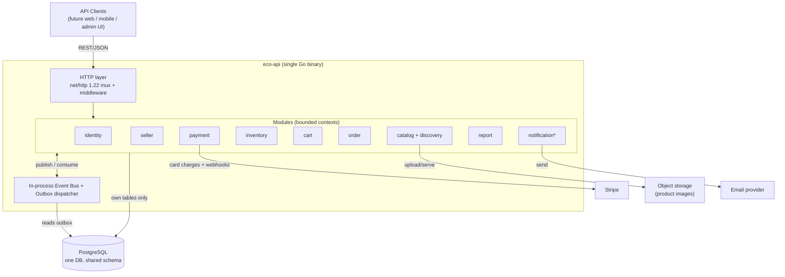
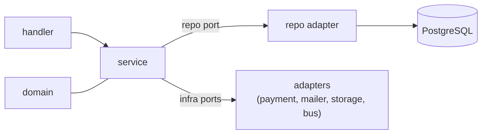
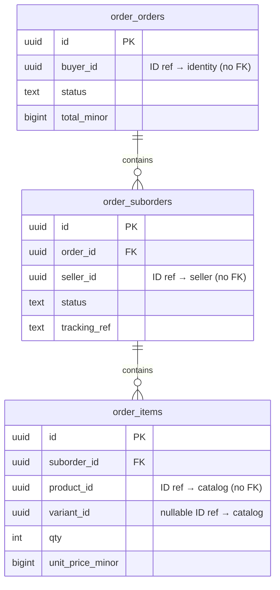
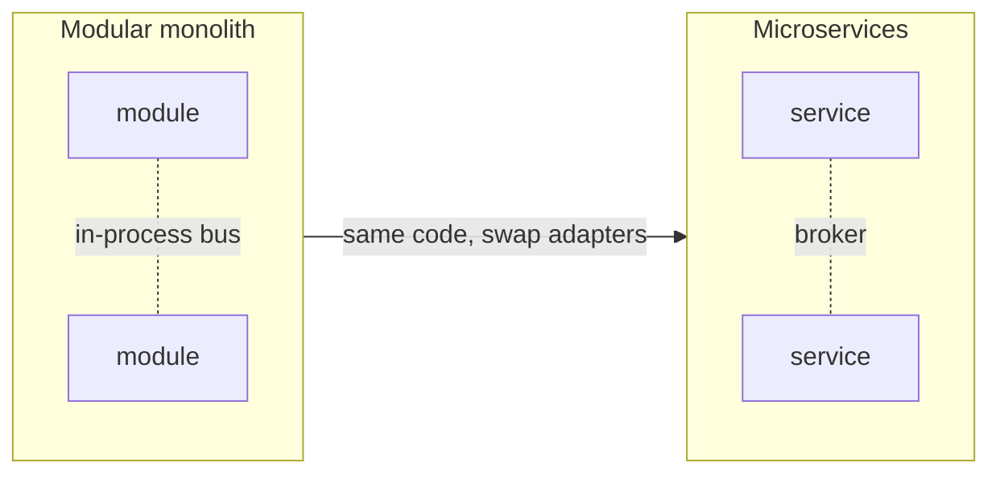

# eco-api — System Architecture Document

| | |
|---|---|
| **Product** | `eco-api` — Multi-vendor B2C retail marketplace |
| **Document** | System Architecture Document (SAD) |
| **Version** | 1.0 |
| **Status** | Approved for build |
| **Date** | 2026-06-15 |
| **Companion** | [docs/PRD.md](PRD.md) (the *what*; this document is the *how*) |
| **Style** | Modular monolith · Go · API-first · event-driven · microservice-ready |

---

## 1. Overview

`eco-api` is built as a **modular monolith**: a single deployable Go binary internally divided into
independent **modules** (bounded contexts), each owning its data and business logic and communicating
through explicit contracts. This gives the productivity of one codebase/one deploy now, while keeping
**clean seams** so individual modules can later be extracted into microservices with minimal rework.

The defining rule of the whole design: **business logic depends only on interfaces; all shared and
infrastructure concerns (database, payments, storage, email, transport) are adapters behind those
interfaces.** A service never imports an SDK.

### Goals
- **Separation of concerns** — business logic isolated from infrastructure.
- **Strong module boundaries** — modules interact only via public interfaces and events, never each other's tables.
- **Microservice-readiness** — any module can be lifted out without rewriting its core.
- **Code quality & learnability** — explicit, idiomatic Go over framework "magic" (this is a solo, learning-Go project).

### Non-goals (MVP)
Distributed deployment, a message broker, multiple databases, CQRS event sourcing, and the product
items deferred in PRD §9. These are *designed for*, not *built*.

---

## 2. Architecture Principles & Constraints

1. **The Dependency Rule.** Dependencies point inward: `handler → service → (ports) ← adapters`. The
   `service` (business logic) and `domain` packages import **no** infrastructure.
2. **Module independence.** A module exposes a single public surface (`port.go`): its callable
   interface + the events it publishes/consumes. Everything else is internal.
3. **No shared business tables.** Each module owns its tables; **no cross-module joins or foreign
   keys**. Cross-module references are by **ID only**, resolved via ports (sync) or events (async).
4. **Event-driven first.** Cross-module *reactions* happen via domain events; synchronous calls are
   reserved for *reads a request cannot proceed without*.
5. **Reliability by construction.** State change + event emission are **atomic** (transactional
   outbox); all event handlers are **idempotent**.
6. **Explicit composition.** All wiring happens in one composition root (`cmd/api/main.go`); no global
   singletons, no service locator.

---

## 3. High-Level Architecture

Single binary today; the boundaries drawn below are the future service boundaries.



- **Inbound:** REST/JSON over HTTP. The API is the only product surface in the MVP (PRD: headless).
- **Outbound (behind ports):** Stripe (payments), object storage (images), email (notifications).
- **Data:** one PostgreSQL instance, one schema, with strict per-module table ownership.

---

## 4. Module / Bounded-Context Map

| Module | Responsibility | Owns (prefixed tables) | Publishes | Consumes |
|---|---|---|---|---|
| **identity** | Accounts, auth, roles, profiles, addresses | `identity_users`, `identity_addresses` | `UserRegistered` | — |
| **seller** | Seller application, approval/suspension, store profile | `seller_sellers`, `seller_stores` | `SellerApproved`, `SellerSuspended` | — |
| **catalog** | Categories, products, variants; **discovery** (public read side) | `catalog_categories`, `catalog_products`, `catalog_variants` | `ProductPublished`, `ProductUnpublished` | `SellerSuspended` |
| **inventory** | Stock per sellable unit; sync stock-check port | `inventory_stock` | `StockDepleted` | `OrderPaid` |
| **cart** | Variant-aware persistent cart | `cart_carts`, `cart_items` | — | `ProductUnpublished` |
| **order** | Orders, per-seller sub-orders, lifecycle, fulfilment | `order_orders`, `order_suborders`, `order_items` | `OrderPlaced`, `OrderPaid`, `OrderShipped`, `OrderCancelled`, `OrderCompleted` | `PaymentConfirmed`, `PaymentFailed` |
| **payment** | Payment intents, Stripe adapter, webhook ingest | `payment_payments` | `PaymentConfirmed`, `PaymentFailed` | `OrderPlaced` |
| **report** | Earnings ledger + seller/platform read models | `report_earnings_ledger`, `report_seller_metrics`, `report_platform_metrics` | — | `OrderPaid`, `OrderCancelled`, `OrderCompleted` |
| *notification* (stretch) | Transactional email | — | — | most events |
| *review* (stretch) | Product ratings/reviews | `review_reviews` | — | `OrderCompleted` |

**Resolved design choices:**
- **Admin is not a module.** Admin actions are **RBAC-gated operations on the owning module**:
  approve/suspend seller → `seller`; moderate/unpublish product → `catalog`; platform metrics → `report`.
- **Discovery is the read side of `catalog`** (browse/filter/sort/search), not a separate module — flagged as a future split candidate.
- **The earnings ledger lives in `report`** and is built entirely from `order` events (read model), so `report` never touches `order`'s tables.

---

## 5. Module Internal Structure & Project Layout

Every module follows the same **layered** shape, with **interfaces at every boundary**:

```
internal/modules/<name>/
  domain/      # entities, value objects, domain events, invariants — pure Go, no imports of infra
  service/     # business logic / use cases; depends ONLY on ports (interfaces)
  repo/        # data access: sqlc-generated queries + repository implementing the service's port
  handler/     # net/http transport: decode → call service → encode; no business logic
  port.go      # the module's PUBLIC surface: its interface(s) + events published/consumed
```



The `service` defines the interfaces it needs (e.g. `type Repository interface{...}`,
`type Publisher interface{...}`); `repo` and the platform adapters satisfy them. This is what makes
services unit-testable with mocks and infrastructure swappable.

### Full project layout

```
eco-api/
  cmd/api/main.go              # composition root: load config → build adapters → wire modules → serve
  internal/
    platform/                  # shared, business-agnostic infrastructure (the "abstracted layers")
      config/                  # env-based configuration loader
      log/                     # log/slog setup (JSON, leveled, request-scoped)
      httpx/                   # server, 1.22 mux router, middleware, response/error/pagination helpers
      db/                      # pgx pool, transaction helpers (RunInTx)
      events/                  # Event bus interface + in-process impl + outbox writer/dispatcher
      auth/                    # JWT issue/verify, password hashing, RBAC + ownership middleware
      payment/                 # Payment port + Stripe adapter + webhook signature verification
      storage/                 # File-storage port + adapter (local now, S3-compatible later)
      mailer/                  # Email port + adapter (log/no-op now, SMTP/provider later)
      validate/                # request validation helpers
      id/                      # UUID generation
    modules/
      identity/ seller/ catalog/ inventory/ cart/ order/ payment/ report/   # (+ notification, review)
  migrations/                  # golang-migrate; one ordered set, files name-prefixed by module
  api/                         # OpenAPI specification
  docs/                        # PRD.md, ARCHITECTURE.md, adr/
```

**Note on `internal/`:** using Go's `internal/` keeps modules from being imported outside the binary,
and cross-module imports are limited by convention to a sibling's `port.go` only.

---

## 6. Cross-Cutting Shared Layers (Ports & Adapters)

Each infrastructure concern is a **port** (interface) consumed by business logic, with an **adapter**
implementation wired in at startup. This is the literal realization of "shared layers abstracted away
from the business logic."

| Concern | Port (consumed by services) | MVP adapter | Later |
|---|---|---|---|
| Persistence | module `Repository` interfaces | pgx + **sqlc**-generated queries | unchanged (per-service DB) |
| Events | `Publisher` / `Subscriber` | in-process bus + **outbox** | broker (NATS/Kafka) |
| Payments | `payment.Gateway` | **Stripe** adapter | + COD, local gateway adapters |
| File storage | `storage.Store` | local filesystem | S3-compatible |
| Email | `mailer.Mailer` | log/no-op | SMTP/provider |
| Auth | `auth.TokenIssuer/Verifier`, `auth.Hasher` | JWT + bcrypt/argon2 | unchanged |
| Config | typed `Config` struct | env vars | secrets manager |
| Logging | `*slog.Logger` | slog JSON to stdout | + log aggregator |

**Hard rule (lintable later):** packages under `domain/` and `service/` must not import `stripe-go`,
`pgx`, `net/http`, or any other infrastructure SDK. Only `platform/*` adapters and `repo/` may.

---

## 7. Inter-Module Communication

### Rules
- **Reactions / side-effects → events.** A module publishes a domain event; interested modules react.
- **Reads a request can't proceed without → synchronous query ports.** e.g. checkout must read live
  price (catalog) and availability (inventory) *now*; these are narrow read-only interfaces.
- **Never** call another module's repo or read its tables.

### Event bus + transactional outbox

```mermaid
sequenceDiagram
  participant Svc as Module service
  participant DB as PostgreSQL
  participant Disp as Outbox dispatcher
  participant Bus as In-process bus
  participant H as Handler (other module)

  Svc->>DB: BEGIN; write aggregate change + INSERT into outbox; COMMIT
  Note over Svc,DB: state change and event are atomic
  Disp->>DB: poll unsent outbox rows
  Disp->>Bus: publish event
  Bus->>H: deliver event
  H->>DB: process idempotently (dedupe by event_id) + mark handled
  Disp->>DB: mark outbox row dispatched
```

- **Atomicity:** the event row is written in the **same transaction** as the state change — no lost or phantom events.
- **Idempotency:** every event has a UUID `event_id`; each consumer records processed IDs (`platform_processed_events`) and ignores duplicates → safe at-least-once delivery.
- **Outbox & processed-events are platform infrastructure tables** (generic plumbing), not business
  tables; on extraction each service carries its own outbox instance.
- **Async by default:** handlers run off the request path. The only synchronous, in-transaction
  effects are correctness-critical invariants (see §9).

### Event catalog (initial)

| Event | Producer | Key payload | Consumers / effect |
|---|---|---|---|
| `UserRegistered` | identity | userId, email | notification (welcome) |
| `SellerApproved` | seller | sellerId | notification |
| `SellerSuspended` | seller | sellerId | catalog (hide products) |
| `ProductUnpublished` | catalog | productId | cart (prune lines) |
| `OrderPlaced` | order | orderId, amount, buyerId | payment (create intent) |
| `PaymentConfirmed` | payment | orderId, paymentId | order (→ paid) |
| `PaymentFailed` | payment | orderId | order (stays pending) |
| `OrderPaid` | order | orderId, suborders[], items[] | inventory (decrement), report (ledger), notification |
| `OrderShipped` / `OrderCompleted` / `OrderCancelled` | order | suborderId | report, notification, review eligibility |

---

## 8. Data Architecture

- **One PostgreSQL database, one schema.** Boundaries are **logical**, enforced by discipline + review:
  - Each table is **prefixed by its owning module** (`catalog_products`, `order_suborders`, …).
  - **No foreign keys or joins across module prefixes.** Cross-module links store the foreign **ID**
    only (e.g. `order_items.product_id` is a plain UUID, not an FK to `catalog_products`).
  - A module's repo queries only its own tables.
- **Transactions:** the platform `db.RunInTx` helper wraps a unit of work; the outbox insert joins it.
- **Migrations:** `golang-migrate`, a single ordered sequence; filenames are module-prefixed for clarity.
- **Money & quantities:** integer minor units (e.g. cents) — never floats.



*FKs exist only **within** a module (e.g. `order_*`). All `*_id` fields pointing at other modules are
plain IDs — the dotted lines you'd normally draw between modules are intentionally absent.*

**Module → table map** is maintained in Appendix B.

---

## 9. Key Runtime Flows

### 9.1 Checkout → payment → order paid (the critical path)

```mermaid
sequenceDiagram
  actor Buyer
  participant ORD as order
  participant CAT as catalog (sync port)
  participant INV as inventory (sync port)
  participant PAY as payment
  participant STR as Stripe
  participant BUS as bus/outbox
  participant REP as report

  Buyer->>ORD: POST /checkout (cart, address)
  ORD->>CAT: GetPrices(productIds)   %% sync read
  ORD->>INV: CheckAvailability(units) %% sync read
  ORD->>ORD: create order + N suborders (pending_payment) [tx + outbox: OrderPlaced]
  BUS-->>PAY: OrderPlaced
  PAY->>STR: create PaymentIntent
  STR-->>Buyer: client secret (pay)
  STR-->>PAY: webhook: payment_succeeded (verified, idempotent)
  PAY->>PAY: record payment [tx + outbox: PaymentConfirmed]
  BUS-->>ORD: PaymentConfirmed
  ORD->>ORD: status→paid; decrement stock + write ledger atomically [tx + outbox: OrderPaid]
  BUS-->>INV: OrderPaid (reconcile/confirm)
  BUS-->>REP: OrderPaid → update earnings ledger + seller metrics
```

**Consistency decision (important):** stock decrement and the earnings-ledger write are
**correctness-critical**, so on `PaymentConfirmed` the `order` module performs them **within the same
transaction** as the status change (reading inventory via its port), rather than relying on
eventually-consistent handlers — this avoids oversell/under-report. `report`'s read-model update and
notifications remain **async**. (Trade-off noted in §16.)

### 9.2 Multi-seller fulfilment
A checkout spanning *N* sellers yields *N* `order_suborders`, each advanced independently by its
seller (`processing → shipped(+tracking) → delivered → completed`); each transition emits an event
consumed by `report` and `notification`. The buyer sees all suborders under one order.

### 9.3 Seller report (read model)
`report` maintains `report_seller_metrics` from `OrderPaid/Cancelled/Completed` events, so
`GET /seller/reports` is a single fast read of pre-aggregated data — **no querying of `order` tables**,
which is exactly what keeps `report` independently extractable.

---

## 10. Security Architecture

- **AuthN:** email+password; bcrypt/argon2 hashing; short-lived **JWT** access tokens (+ refresh
  token) issued by `auth`. Tokens carry `userId` + `role`.
- **AuthZ:** `auth` middleware enforces **RBAC** (buyer/seller/admin) per route; services additionally
  enforce **ownership/tenant isolation** (a seller can act only on its own resources — PRD FR-9).
- **Stripe webhooks:** signature verified with the endpoint secret before processing; the handler is
  **idempotent** by Stripe event ID (PRD FR-29/FR-30); webhooks are the source of truth for payment
  success, never the client.
- **Secrets:** via environment/secret manager; never logged; the platform never stores card data.
- **Transport:** TLS terminated at the edge; input validated at the handler boundary; standardized
  error envelope avoids leaking internals.

---

## 11. Non-Functional Requirement Realization (maps PRD §7)

| PRD NFR | Mechanism here |
|---|---|
| Security | JWT + RBAC + ownership checks; TLS; hashed passwords; no card storage (§10) |
| Reliability & integrity | Transactional outbox; idempotent handlers; in-tx critical invariants; integer money |
| Performance | Paginated/bounded list endpoints; report read models; pgx pooling; DB indexes per query |
| API consistency | `httpx` standardized response/error envelope + uniform pagination |
| Documentation | OpenAPI spec in `api/`; this SAD; ADRs |
| Observability | `slog` structured logs with request/correlation IDs across handler→service→adapter |
| Privacy | Tenant isolation in services; buyer PII reachable only by owner/admin |

---

## 12. Technology Choices

| Area | Choice | Why |
|---|---|---|
| Language | **Go 1.22+** | Stdlib mux with method+path routing; simple concurrency; great learning target |
| HTTP | **net/http** + `http.ServeMux` | No framework lock-in; middleware as `http.Handler` wrappers |
| DB driver/pool | **pgx** | Fast, idiomatic Postgres driver with pooling |
| Queries | **sqlc** | Generates type-safe Go from SQL → explicit, no ORM magic, keeps repo thin |
| Migrations | **golang-migrate** | Simple, ordered, CI-friendly |
| Logging | **log/slog** | Stdlib structured logging |
| Auth | **golang-jwt** + bcrypt/argon2 | Standard JWT + password hashing |
| IDs | **google/uuid** | Stable external identifiers, decouples from DB sequences |
| Payments | **stripe-go** (behind `payment.Gateway`) | Official SDK, isolated to one adapter |
| Tests | stdlib `testing` + testcontainers-go | Table-driven units + real-Postgres integration |

ORM intentionally avoided: sqlc keeps SQL explicit and the repo layer mechanical — better for
learning and for clean boundaries.

---

## 13. Testing Strategy

- **Unit (services):** business logic tested against **mocked ports** (interfaces make this trivial); table-driven.
- **Integration (repos):** run against a **real Postgres** (testcontainers-go) to validate SQL/migrations.
- **Event/contract tests:** assert producers emit the documented payloads and handlers are idempotent (apply same event twice → one effect).
- **End-to-end (happy paths):** drive the HTTP API for the buyer and seller journeys in PRD §verification.
- **Static gates:** `go vet`, `golangci-lint`, and an **import-boundary check** enforcing the §6 hard rule.

---

## 14. Deployment & Operations

- **Artifact:** single statically-linked binary; multi-stage **Dockerfile**.
- **Config:** environment variables (12-factor); typed `config.Config` validated at startup.
- **Migrations:** run as an explicit step (`migrate up`) before/at deploy.
- **Health:** `/healthz` (liveness) and `/readyz` (DB + dependencies) endpoints.
- **Lifecycle:** graceful shutdown via `context` + `http.Server.Shutdown`; the outbox dispatcher drains on stop.
- **Local dev:** `docker-compose` with Postgres; Stripe CLI for webhook forwarding.

---

## 15. Path to Microservices

The monolith is arranged so extraction is mechanical rather than a rewrite:

1. **Pick a leaf module** (best first candidates: `notification`, then `payment`) — few sync dependencies.
2. **Stand it up as its own binary** reusing the *same* `service`/`domain`/`repo` packages.
3. **Carve its tables** out of the shared schema into its own schema/DB (the no-cross-FK rule means nothing else joins them).
4. **Swap the bus for a broker:** the in-process `Publisher`/`Subscriber` adapters become broker
   adapters; the **outbox stays** (now the broker publisher reads it).
5. **Replace sync query ports** to that module with an RPC/HTTP client implementing the *same* interface.
6. Repeat per module; the monolith shrinks into a set of services that already speak the same events.



---

## 16. Risks & Trade-offs

| Risk | Mitigation |
|---|---|
| **Shared schema couples modules** (the main extraction risk) | Per-module table prefixes + **no cross-module FK/join** + references-by-ID; enforced in review/linting |
| **Event-driven adds cognitive/debug overhead** | Outbox + idempotency + structured logs with correlation IDs; keep critical invariants synchronous |
| **Async stock/ledger could oversell/under-report** | Handle these two invariants **in-transaction** on `PaymentConfirmed` (§9.1); only non-critical reactions are async |
| **Boundary discipline can erode under time pressure** | Import-boundary lint gate; `port.go` as the only cross-module entry; ADRs record the rules |
| **Solo + learning Go** | Idiomatic, explicit stack (no ORM/framework magic); build in the PRD's weekly order; stretch modules are cuttable |

---

## Appendix A — Initial ADR log

| ADR | Decision | Status |
|---|---|---|
| ADR-001 | Classic layered modules with interfaces at boundaries | Accepted |
| ADR-002 | Event-driven-first comms; sync query ports for read-time data | Accepted |
| ADR-003 | One PostgreSQL, shared schema, per-module table ownership, no cross-module FK | Accepted (see §16 risk) |
| ADR-004 | stdlib net/http + pgx + sqlc + golang-migrate; no ORM/framework | Accepted |
| ADR-005 | Transactional outbox + idempotent consumers for reliable events | Accepted |

## Appendix B — Module ↔ table map

| Module | Tables |
|---|---|
| identity | `identity_users`, `identity_addresses` |
| seller | `seller_sellers`, `seller_stores` |
| catalog | `catalog_categories`, `catalog_products`, `catalog_variants` |
| inventory | `inventory_stock` |
| cart | `cart_carts`, `cart_items` |
| order | `order_orders`, `order_suborders`, `order_items` |
| payment | `payment_payments` |
| report | `report_earnings_ledger`, `report_seller_metrics`, `report_platform_metrics` |
| review (stretch) | `review_reviews` |
| platform (infra) | `platform_outbox`, `platform_processed_events` |

## Appendix C — Glossary

- **Module / bounded context** — an independently-owned slice of the domain (the future service boundary).
- **Port** — an interface a service depends on; **Adapter** — its infrastructure implementation.
- **Transactional outbox** — pattern where events are written in the same DB tx as the state change, then relayed.
- **Read model** — a denormalized, query-optimized projection built from events (e.g. `report` metrics).
- **Sellable unit** — a variant, or the product itself when variant-less (carries price + stock).

> Terms shared with the product spec (GMV, sub-order, succeeded order, earnings) are defined in [PRD.md](PRD.md) Appendix A.
