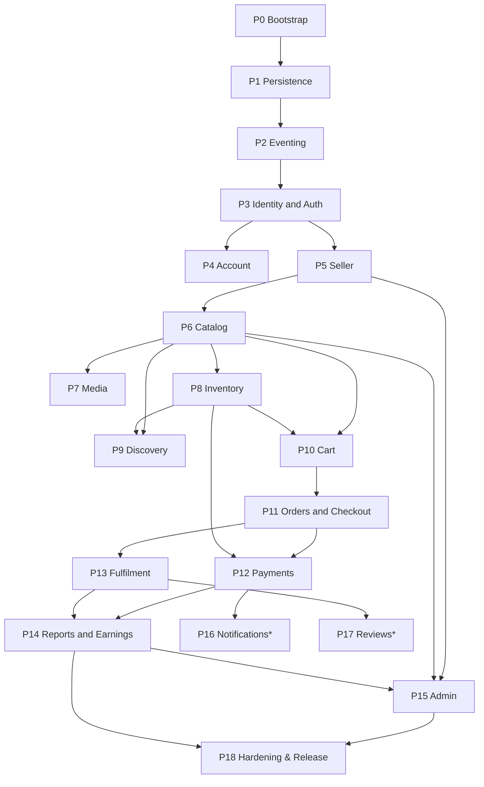

# eco-api — Phased Implementation Plan

| | |
|---|---|
| **Product** | `eco-api` — Multi-vendor B2C marketplace (Go, modular monolith, API-first) |
| **Document** | Implementation roadmap (build order) |
| **Version** | 1.0 |
| **Date** | 2026-06-15 |
| **Companions** | [PRD.md](PRD.md) · [ARCHITECTURE.md](ARCHITECTURE.md) · [../api/openapi.yaml](../api/openapi.yaml) |

## How to use this document

This is the **order in which to build the system**. Phases are sequenced by **dependency**, not
calendar — never start a phase before its prerequisites exist. Each phase is described at the level of
**logical construction** (what to build and why), not code. Every phase ends in something **demoable**,
so progress is always visible.

Stretch phases (**P16–P17**) are optional and cuttable: nothing depends on them.

**Each phase below uses this template**

- **Goal** — why the phase exists / what it unlocks.
- **Scope** — the logical building blocks to construct.
- **Depends on** — prerequisite phases.
- **Contracts & events** — ports exposed; domain events published/consumed.
- **Realizes** — the PRD requirements / OpenAPI operations delivered.
- **Definition of Done** — the demoable outcome + how to verify.
- **Risks / pitfalls** — what to watch out for.

## Dependency overview

## Calendar mapping (secondary)

| Week | Phases | Focus |
|---|---|---|
| 1 | P0–P5 | Foundations + identity + seller |
| 2 | P6–P9 | Catalog, media, inventory, discovery |
| 3 | P10–P12 | Cart, orders, payments (critical path) |
| 4 | P13–P15, P18 | Fulfilment, reports, admin, hardening |
| flex | P16–P17 | Stretch — only if ahead of schedule |

> Aggressive for one developer learning Go. The calendar is a guide; **the dependency order is the contract.**

---

# Foundations

## P0 — Project Bootstrapping
- **Goal:** Stand up a runnable "walking skeleton" — an empty but well-structured service that boots and serves health — so layout and shared HTTP plumbing are decided once, before any feature.
- **Scope:**
  - Repository + Go module; the agreed layout (`cmd/api`, `internal/platform/*`, `internal/modules/*`, `migrations/`, `api/`, `docs/`).
  - Typed configuration from environment, validated at startup.
  - Structured logging with levels and request-scoped correlation.
  - HTTP server, router, middleware chain (request id, logging, recovery), and the **standardized response/error envelope** + pagination helpers.
  - Liveness/readiness probes; graceful shutdown.
  - Local dev: docker-compose (Postgres) and a task runner for run/lint/test/build.
- **Depends on:** —
- **Contracts & events:** the response/error + pagination contract (from the OpenAPI spec). No domain events yet.
- **Realizes:** OpenAPI **System** tag; the "API consistency" NFR foundation.
- **Definition of Done:** the service boots; `GET /healthz` returns the health envelope; lint/test/build pipeline is green; compose brings up Postgres. *Demo: hit `/healthz`.*
- **Risks / pitfalls:** over-engineering the skeleton; bikeshedding the layout — decide and move on; keep middleware minimal for now.

## P1 — Persistence Foundation
- **Goal:** Give the service a database it can connect to, migrate, and query type-safely — and lock in the shared-schema discipline before the first table exists.
- **Scope:**
  - Connection pool wired into config and the readiness probe.
  - A shared transaction helper (the unit-of-work the outbox and services reuse).
  - Migration tooling with a baseline migration (extensions, conventions).
  - Type-safe query generation workflow.
  - The **`<module>_<table>` prefix / table-ownership convention** documented in `migrations/`.
- **Depends on:** P0.
- **Contracts & events:** the Repository-port convention (services declare interfaces; repos implement). None wired yet.
- **Realizes:** ARCHITECTURE §8 (data architecture); completes `/readyz`.
- **Definition of Done:** app connects on boot; migrations apply cleanly; codegen produces Go from a sample query; `/readyz` reports the DB healthy. *Demo: readyz green against compose Postgres.*
- **Risks / pitfalls:** migration ordering/idempotency; committing to the prefix + **no-cross-module-FK** rule now so extraction stays possible; keeping codegen config from drifting.

## P2 — Eventing Foundation
- **Goal:** Build the event-driven backbone (bus + transactional outbox + idempotent delivery) so modules can react to one another reliably from the start.
- **Scope:**
  - Event-bus interface + in-process implementation.
  - Outbox and processed-events tables (platform infrastructure).
  - Outbox writer enlisted in the transaction helper; a dispatcher that relays committed events to the bus.
  - Idempotency helper (dedupe by event id per consumer).
  - A sample event + handler exercised only by a test.
- **Depends on:** P1.
- **Contracts & events:** `Publisher`/`Subscriber` ports; the event envelope (id, type, occurred-at, payload).
- **Realizes:** ARCHITECTURE §7 (inter-module communication) + the reliability NFR.
- **Definition of Done:** in a test, a state change and its event commit atomically; the dispatcher delivers; replaying the same event produces exactly one effect. *Demo: a test proving exactly-once handling.*
- **Risks / pitfalls:** delivery is at-least-once → handlers must be idempotent; dispatcher liveness; resist building broker features now (YAGNI). First real producers/consumers land in P5/P6/P11+.

---

# Core modules

## P3 — Identity & Auth (the auth-module)
- **Goal:** The first real module — accounts, authentication, and roles — and the **canonical module shape** every later module copies.
- **Scope:**
  - Registration, login, logout; password hashing.
  - Access + refresh token issuance/verification behind an auth port.
  - Password reset (request + confirm).
  - RBAC middleware (role from token) and the module template (`domain` / `service` / `repo` / `handler` / `port`).
  - Publishes `UserRegistered`.
- **Depends on:** P0–P2.
- **Contracts & events:** token-issuer/verifier and hasher ports; RBAC middleware; `UserRegistered`.
- **Realizes:** PRD FR-1–FR-4; OpenAPI **Authentication** tag.
- **Definition of Done:** register → login → call a protected endpoint with the token; a wrong-role call is rejected. *Demo: a full auth round-trip through the API.*
- **Risks / pitfalls:** token lifetime/refresh handling; password-hashing cost; **getting the module template right (later modules inherit its mistakes)**; never log secrets.

## P4 — Account: Profile & Addresses
- **Goal:** Let users manage their profile and shipping addresses; establish ownership/tenant-isolation as a reusable rule.
- **Scope:**
  - Profile read/update.
  - Address book CRUD with a default address.
  - Ownership checks (a user touches only their own resources) factored as a shared pattern.
- **Depends on:** P3.
- **Contracts & events:** a platform-wide ownership-enforcement helper. None new.
- **Realizes:** PRD FR-1 (address book); OpenAPI **Account** tag.
- **Definition of Done:** a user creates/edits/deletes addresses and sets a default, and **cannot** access another user's address. *Demo: address CRUD plus a denied cross-user access.*
- **Risks / pitfalls:** authorization gaps — test the negative cases; default-address invariants (exactly one default).

## P5 — Seller Onboarding & Store
- **Goal:** Turn buyers into sellers through an admin-gated workflow; introduce the **"admin = RBAC-gated operations on the owning module"** pattern.
- **Scope:**
  - Application submission (one active application rule).
  - Admin approve / reject / suspend; the seller status lifecycle.
  - Store-profile management for approved sellers.
  - Publishes `SellerApproved` / `SellerSuspended`.
- **Depends on:** P3 (roles), P2 (events).
- **Contracts & events:** seller public port (status lookups for other modules); `SellerApproved` / `SellerSuspended`.
- **Realizes:** PRD FR-5–FR-9; OpenAPI **Seller** tag + admin seller endpoints.
- **Definition of Done:** buyer applies → admin approves → role becomes seller → store editable; suspension blocks future seller actions. *Demo: the onboarding round-trip.*
- **Risks / pitfalls:** role-transition consistency; idempotent approval; admin authorization; treating seller **status as the source of truth** other modules read via the port.

## P6 — Catalog: Categories, Products, Variants
- **Goal:** The sellable catalog — categories, products, and the optional two-axis variant model.
- **Scope:**
  - Admin-managed categories.
  - Seller product CRUD with status (draft / active / inactive).
  - **Optional variants** on color/size with per-variant SKU, price, stock; the "sellable unit" concept (a variant, or the variant-less product).
  - Publishes `ProductPublished` / `ProductUnpublished`; consumes `SellerSuspended` to hide products.
- **Depends on:** P5 (seller), P2 (events).
- **Contracts & events:** catalog query port (product/price lookups for cart & order); `ProductPublished`/`ProductUnpublished`; consumes `SellerSuspended`.
- **Realizes:** PRD FR-10–FR-15, FR-41; OpenAPI **Categories** + **Products** (write) tags.
- **Definition of Done:** an approved seller creates a product **with and without** variants; a suspended seller's products stop being discoverable. *Demo: product + variant creation; visibility flips on suspend.*
- **Risks / pitfalls:** keep variants to the two optional axes; reference seller/category **by ID only** (no cross-module FK); status/visibility correctness.

## P7 — Product Media
- **Goal:** Let sellers attach images to products through a storage abstraction.
- **Scope:**
  - Storage port + local adapter (S3-compatible later).
  - Image upload (multipart), ordering, and URL exposure on products.
- **Depends on:** P6.
- **Contracts & events:** storage port. None new.
- **Realizes:** PRD product-image requirement; OpenAPI `POST /products/{id}/images`.
- **Definition of Done:** a seller uploads an image and it appears on the product detail. *Demo: upload then see the image URL.*
- **Risks / pitfalls:** file type/size validation; keeping storage strictly behind the port (no direct filesystem in services); orphaned files on delete.

## P8 — Inventory & Availability
- **Goal:** Track stock per sellable unit and expose availability, with the decrement-on-payment rule.
- **Scope:**
  - Stock per sellable unit; an availability query port used by cart/checkout.
  - Decrement semantics (applied at payment success, idempotently).
  - Consumes `OrderPaid` (reconcile/confirm); publishes `StockDepleted`.
- **Depends on:** P6 (sellable units), P2 (events).
- **Contracts & events:** inventory availability query port; consumes `OrderPaid`; publishes `StockDepleted`.
- **Realizes:** PRD FR-16–FR-18.
- **Definition of Done:** stock is queryable; an availability check rejects over-ordering; a decrement applied twice yields one effect. *Demo: availability check + idempotent-decrement test.*
- **Risks / pitfalls:** the oversell race (decide reserve-at-checkout vs check-at-payment); idempotency; the decrement's transactional home is finalized in P12.

## P9 — Discovery (public read side)
- **Goal:** The public browsing experience over the catalog.
- **Scope:**
  - Listing with filters (category, seller, color, size, price range), sort (newest / price), pagination.
  - Keyword search over title/description.
  - Product detail with variants, availability, and seller info.
  - Returns **only discoverable** products (active + approved, non-suspended seller).
- **Depends on:** P6 (catalog), P8 (availability), P5 (seller status).
- **Contracts & events:** none new (read side of catalog).
- **Realizes:** PRD FR-19–FR-22; OpenAPI **Discovery** tag.
- **Definition of Done:** an anonymous user browses, filters, searches, and opens a product; hidden products never appear. *Demo: filtered search + detail as a guest.*
- **Risks / pitfalls:** query performance/indexes; search approach (Postgres full-text for MVP); pagination consistency; visibility-rule correctness.

---

# Commerce path

## P10 — Cart
- **Goal:** A persistent, variant-aware cart that reads live data through ports.
- **Scope:**
  - Cart operations (add / update / remove / clear), keyed to the buyer.
  - Line items reference a specific sellable unit.
  - Reads price (catalog port) and availability (inventory port).
  - Consumes `ProductUnpublished` to prune stale lines.
- **Depends on:** P6, P8, P3.
- **Contracts & events:** consumes `ProductUnpublished`; uses catalog + inventory ports.
- **Realizes:** PRD FR-23–FR-24; OpenAPI **Cart** tag.
- **Definition of Done:** a buyer builds a multi-seller cart with correct live prices; an unpublished item is pruned. *Demo: a cart spanning two sellers; prune on unpublish.*
- **Risks / pitfalls:** price snapshot vs live price; stale/unavailable items; cross-module reads strictly via ports.

## P11 — Orders & Checkout
- **Goal:** Convert a cart into orders — the multi-seller split and the order lifecycle — before payment.
- **Scope:**
  - Order + **per-seller sub-order** model; checkout splits the cart into one sub-order per seller.
  - Totals (merchandise + optional per-seller flat shipping).
  - Order lifecycle state machine, starting at `pending_payment`.
  - Buyer order history/detail; cancel-before-shipped.
  - Publishes `OrderPlaced`.
- **Depends on:** P10 (cart), P6/P8 (reads), P2 (events).
- **Contracts & events:** order public port; `OrderPlaced` (later `OrderPaid`/`OrderShipped`/`OrderCompleted`/`OrderCancelled`).
- **Realizes:** PRD FR-25–FR-27, FR-35–FR-36; OpenAPI **Orders** (buyer) tag (minus payment confirmation).
- **Definition of Done:** checkout creates one order with N sub-orders in `pending_payment`; the buyer lists/views orders and cancels before shipping. *Demo: a multi-seller checkout producing N sub-orders.*
- **Risks / pitfalls:** split correctness; state-machine transition guards; money math in minor units; reading price/stock consistently at checkout time.

## P12 — Payments (Stripe)
- **Goal:** Make orders actually paid, reliably — the critical correctness path.
- **Scope:**
  - Payment-gateway port + Stripe adapter; a PaymentIntent created on `OrderPlaced`.
  - Webhook endpoint with **signature verification + idempotent** handling.
  - `PaymentConfirmed` → order becomes `paid` → **in the same transaction: stock decrement + earnings-ledger entry**.
  - Publishes `PaymentConfirmed` / `PaymentFailed`; payment-method abstraction ready for COD / local gateway.
- **Depends on:** P11 (orders), P8 (inventory), P2 (events).
- **Contracts & events:** payment-gateway port; `PaymentConfirmed`/`PaymentFailed`; consumes `OrderPlaced`.
- **Realizes:** PRD FR-28–FR-31, FR-37; OpenAPI **Payments** tag + checkout payment + retry.
- **Definition of Done:** a full Stripe **test-mode** payment moves the order to `paid` exactly once, decrements stock once, and writes one ledger entry; a replayed webhook is a no-op. *Demo: end-to-end paid order via the Stripe CLI webhook.*
- **Risks / pitfalls:** webhook signature/idempotency; **the in-transaction invariant (stock + ledger)** to avoid oversell/under-report; test-mode wiring; keeping the gateway swappable.

## P13 — Fulfilment
- **Goal:** Let sellers fulfil their sub-orders independently and keep buyers informed.
- **Scope:**
  - Seller sub-order list/detail.
  - **Guarded** transitions: `processing → shipped (+ tracking) → delivered`; completion.
  - Per-seller independence within one order.
  - Publishes `OrderShipped` / `OrderCompleted`.
- **Depends on:** P11 (orders), P5 (seller), P2 (events).
- **Contracts & events:** `OrderShipped` / `OrderCompleted`.
- **Realizes:** PRD FR-32–FR-34; OpenAPI **Orders (Seller)** tag.
- **Definition of Done:** a seller advances a sub-order with a tracking reference; the buyer sees the updated status; an illegal transition is rejected. *Demo: fulfil one sub-order of a two-seller order.*
- **Risks / pitfalls:** transition guards; who may complete an order; sub-order independence; emitting events downstream reports/notifications rely on.

## P14 — Reports & Earnings
- **Goal:** Turn order events into seller and platform insight, and the manual-payout ledger.
- **Scope:**
  - **Earnings ledger** built from order events (read model).
  - Seller report summary (total products, total orders, succeeded orders, total sales value, earnings) + orders-by-status.
  - Platform metrics (GMV, counts, active sellers/products).
  - Consumes `OrderPaid` / `OrderCancelled` / `OrderCompleted`; **never queries order tables**.
- **Depends on:** P12 (`OrderPaid` + ledger), P13 (completion events), P6 (product counts).
- **Contracts & events:** consumes `OrderPaid`/`OrderCancelled`/`OrderCompleted`.
- **Realizes:** PRD FR-37–FR-39, FR-43; OpenAPI **Reports** + admin metrics.
- **Definition of Done:** a seller's report matches the orders placed; admin GMV matches succeeded orders; date-range filters work. *Demo: place/pay orders, then read a correct seller report.*
- **Risks / pitfalls:** read-model consistency / idempotent projection; date-range correctness; resisting cross-module joins; defining *succeeded* and *earnings* exactly per the PRD.

---

# Closeout

## P15 — Admin Consolidation
- **Goal:** Ensure the full admin oversight surface exists and is consistent across modules.
- **Scope:**
  - Product moderation/unpublish, users listing, all-orders listing, platform-metrics surface.
  - Consistent admin RBAC across the owning modules — **no god module**.
- **Depends on:** P5, P6, P11, P14.
- **Contracts & events:** none new.
- **Realizes:** PRD FR-40, FR-42, FR-43; OpenAPI **Admin** tag completion.
- **Definition of Done:** admin moderates a product, lists users/orders, and views metrics. *Demo: admin moderation + oversight reads.*
- **Risks / pitfalls:** authorization consistency; avoiding a data-owning admin module; duplicate endpoints.

## P16 — Notifications (stretch, cuttable)
- **Goal:** Best-effort transactional emails driven by events.
- **Scope:**
  - Mailer port + adapter (log/no-op now).
  - Consume key events (`UserRegistered`, `SellerApproved`, `OrderPaid`, `OrderShipped`) → emails.
- **Depends on:** P2 + the relevant producers.
- **Contracts & events:** mailer port; consumes various events.
- **Realizes:** PRD FR-44 (stretch).
- **Definition of Done:** events produce (logged/sent) emails; a mailer failure never breaks the main flow. *Demo: trigger an order, see the notification fire asynchronously.*
- **Risks / pitfalls:** must be async/best-effort; never block the request path; template scope creep.

## P17 — Reviews (stretch, cuttable)
- **Goal:** Purchase-gated product reviews.
- **Scope:**
  - Review create/list; eligibility = the buyer has a completed order containing the product; one review per buyer per product.
  - Consumes `OrderCompleted` for eligibility.
- **Depends on:** P13 (completion), P6 (products).
- **Contracts & events:** consumes `OrderCompleted`.
- **Realizes:** PRD FR-45 (stretch).
- **Definition of Done:** an eligible buyer reviews a product; ineligible or duplicate attempts are rejected. *Demo: review after completion; duplicate rejected.*
- **Risks / pitfalls:** eligibility check across modules **via event/port, not a join**; spam/abuse.

## P18 — Hardening & Release
- **Goal:** Make the MVP safe, observable, documented, tested, and deployable.
- **Scope:**
  - Rate limiting, an input-validation pass, a security review (authorization, secrets, webhook).
  - Swagger UI served from the OpenAPI spec, kept in sync with handlers.
  - Seed data; unit (mocked ports) + integration (test DB) + e2e happy-path tests.
  - **Import-boundary lint gate** (services never import infrastructure SDKs).
  - Observability (structured logs + correlation), graceful-shutdown verification, staging deploy.
- **Depends on:** all prior phases (work happens continuously; it is *finalized* here).
- **Contracts & events:** none new.
- **Realizes:** PRD §7 (NFRs); ARCHITECTURE §10–§14.
- **Definition of Done:** buyer & seller happy-path e2e pass; lints/tests green; the spec renders in Swagger UI; deployed to staging. *Demo: the e2e suite + a staging smoke test.*
- **Risks / pitfalls:** leaving hardening entirely to the end — **do it continuously**; scope creep; flaky e2e tests.

---

## Appendix A — Event introduction timeline

| Event | Introduced in | Consumed in |
|---|---|---|
| `UserRegistered` | P3 | P16 |
| `SellerApproved` / `SellerSuspended` | P5 | P6 (suspend → hide), P16 |
| `ProductPublished` / `ProductUnpublished` | P6 | P10 (prune) |
| `OrderPlaced` | P11 | P12 |
| `PaymentConfirmed` / `PaymentFailed` | P12 | P11 (→ paid) |
| `OrderPaid` | P12 | P8 (decrement), P14 (ledger), P16 |
| `StockDepleted` | P8 | (ops/alerting; optional) |
| `OrderShipped` / `OrderCompleted` | P13 | P14, P16, P17 |
| `OrderCancelled` | P11/P12 | P14 |

## Appendix B — Coverage matrix (module / concern → phase)

| Module / concern | Phase(s) |
|---|---|
| Platform: config, logging, HTTP, envelope, health | P0 |
| Platform: persistence, migrations, codegen | P1 |
| Platform: eventing (bus + outbox) | P2 |
| identity (accounts, auth, RBAC) | P3 |
| identity (profile, addresses) | P4 |
| seller (onboarding, store, admin lifecycle) | P5 |
| catalog (categories, products, variants) | P6 |
| catalog (media) | P7 |
| inventory | P8 |
| catalog (discovery read side) | P9 |
| cart | P10 |
| order (checkout, lifecycle) | P11, P13 |
| payment | P12 |
| report (earnings, metrics) | P14 |
| admin (oversight) | P5, P6, P11, P15 |
| notification (stretch) | P16 |
| review (stretch) | P17 |
| Security / docs / tests / deploy | P0, P18 (continuous) |
