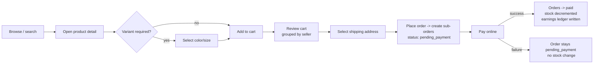
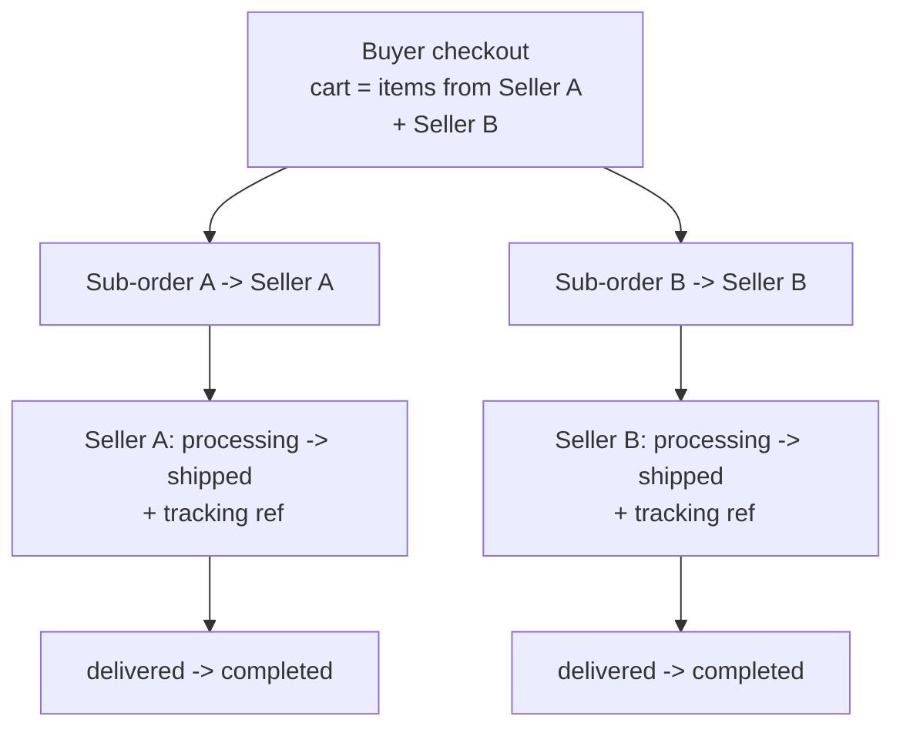

# eco-api — Product Requirements Document (MVP)

| | |
|---|---|
| **Product** | `eco-api` — Multi-vendor B2C retail marketplace |
| **Document** | Product Requirements Document (PRD) |
| **Version** | 1.0 (MVP) |
| **Status** | Approved scope — ready for build |
| **Date** | 2026-06-15 |
| **Target** | ~4 working weeks from kickoff |
| **Delivery** | API-first / headless (no end-user UI in MVP) |

> Scope note: This PRD is **product-only** — it defines *what* the platform does and the rules it
> must enforce, not *how* it is built. Architecture, data model, and integration details live in a
> separate technical design document.

---

## 1. Overview

**eco-api** is a multi-vendor business-to-consumer (B2C) retail marketplace. Independent sellers
open a store, list physical products, and fulfil orders; consumers browse across all sellers, buy
in a single checkout, and track their orders. A platform administrator approves sellers and keeps
the catalog clean.

The MVP is delivered as an **API-first (headless) platform**: every capability is exposed through a
documented programmatic interface, with **no buyer- or seller-facing UI** in this phase. Client
applications (web storefront, mobile, seller dashboard UI) are intentionally out of scope and will
consume this API later.

The MVP **does not monetize**. The platform collects payment online and pays sellers out manually;
it does not yet take a commission. The goal of this phase is a working end-to-end commerce loop and
reliable measurement of **Gross Merchandise Value (GMV)**, not revenue.

**Product principles**
- **Thin but complete:** ship a narrow scope that completes the full buy/sell loop rather than a
  wide scope that completes nothing.
- **Headless first:** the API contract *is* the product surface for the MVP.
- **Designed for what's next:** payment methods, monetization, and additional clients are
  anticipated in the design even though they are not built now.

---

## 2. Goals & Objectives

### Primary goals
1. A consumer can **discover products across multiple sellers and complete a paid purchase** end to end.
2. A seller can **self-onboard, get approved, list products (with optional variants), and fulfil orders**.
3. A seller can **see how their store is performing** through report metrics.
4. The platform can **measure marketplace activity (GMV)** and keep the catalog and sellers in order.

### Success metrics (MVP)
| Objective | Measure of success |
|---|---|
| End-to-end purchase works | ≥ 1 buyer can go from browse → paid order without manual intervention |
| Seller self-service | A seller completes apply → approval → first listing → first fulfilled order |
| Catalog supports real products | Products with and without color/size variants can be listed and bought |
| Marketplace measurability | GMV, order count, and active sellers/products are reportable at any time |
| Seller insight | Each seller can retrieve total products, total/succeeded orders, total sales, and earnings |

### Non-goals (MVP)
Charging a commission, automated payouts, end-user UIs, and the items listed in **§9 Future Scope**.

---

## 3. User Roles

| Role | Description | Key permissions |
|---|---|---|
| **Guest** | Unauthenticated visitor | Browse, search, view product detail. **Cannot** add to cart or buy. |
| **Buyer** | Registered consumer | Everything a Guest can do, plus: manage profile & addresses, manage cart, checkout & pay, view own orders, (stretch) review purchased products. |
| **Seller** | Approved merchant | Manage store profile, manage own products & variants & inventory, view & fulfil own orders, view own report metrics. **Cannot** see other sellers' data. |
| **Admin** | Platform operator | Approve/suspend sellers, manage categories, moderate/unpublish products, view all users & orders, view platform metrics. |

**Rules**
- A single account holds exactly one role in the MVP. A user who wants to sell applies to become a
  Seller; until approved they remain a Buyer.
- Sellers and Buyers can **only** access their own resources. Admin can access all resources.
- All write actions and all buyer/seller/admin reads require authentication; only public catalog
  reads are available to Guests.

---

## 4. Core Features (by domain)

> Priority tags: **(M)** Must — core, protected · **(S)** Should — include if on track · **(C)** Could — stretch, first to cut.

**Identity & Accounts**
- (M) Register, log in, log out, reset password.
- (M) Role-based access control (Buyer / Seller / Admin).
- (M) Buyer & seller profile management.
- (M) Buyer shipping-address book (multiple saved addresses, one default).

**Seller & Store Management**
- (M) Seller application + **admin approval**; seller status: `pending` → `approved` / `rejected`, and `suspended`.
- (M) Store profile: name, logo, description, contact.
- (M) Seller can read their own products and orders.

**Seller Reports & Analytics**
- (M) Seller report metrics: **total products**, **total orders**, **succeeded orders**, **total sales value**, **earnings**.
- (S) Date-range filtering on metrics; order counts broken down by status.

**Catalog & Product Management**
- (M) Admin-managed product **categories**.
- (M) Seller product create/read/update/delete: title, description, images, base price, category, status (`draft` / `active` / `inactive`).
- (M) **Optional variants** on up to two axes — **color** and **size**; each variant has its own SKU, price, and stock. Products may have no variants.
- (M) Inventory tracking per sellable unit (variant, or the product itself when it has no variants).
- (S) Admin product **moderation** (unpublish / take down).

**Discovery (public)**
- (M) Browse by category; paginated product listings.
- (M) Filter by price range, category, color, size, and seller; sort by newest and by price.
- (M) Keyword search across product title/description.
- (M) Product detail with variants, availability, and seller info.

**Cart & Checkout**
- (M) Variant-aware cart, persisted per buyer.
- (M) A cart may contain items from **multiple sellers**; checkout **splits into one sub-order per seller**.
- (M) Order totals: merchandise subtotal + optional per-seller flat shipping (default 0).
- (M) **Online card payment**; the order is confirmed only on successful payment.
- (M) Payment is processed through a **pluggable payment method** layer so additional methods (cash-on-delivery, local gateway) can be added later without redesign.

**Orders & Fulfilment**
- (M) Order lifecycle with a defined state machine (see §6 / Appendix B).
- (M) Per-seller sub-orders; the seller advances fulfilment status and records a tracking reference.
- (M) Buyer order history and status tracking.
- (M) **Seller earnings ledger**: one entry per succeeded sub-order, recording the amount owed — the basis for manual payouts and the earnings metric.

**Admin & Operations**
- (M) Approve / reject / suspend sellers; manage categories; moderate products; view all users and orders.
- (S) Platform metrics: GMV, total orders, active sellers, active products.

**Notifications**
- (C) Transactional notifications: welcome, order confirmation, order-status change, seller new-order alert.

**Reviews**
- (C) Buyers rate and review products they have purchased.

---

## 5. User Flows

### 5.1 Seller onboarding & approval
1. A Buyer submits a **seller application** (store name, description, contact).
2. Status is set to `pending`; the seller cannot list products yet.
3. Admin reviews and **approves** or **rejects**.
4. On approval, the account gains the **Seller** role (status `approved`) and may create a store profile and products.
5. Admin may later **suspend** a seller; suspended sellers' products are hidden from discovery and they cannot create new ones.

### 5.2 Product & variant creation (Seller)
1. Seller creates a product (title, description, images, category, base price) in `draft`.
2. Seller optionally adds variants by choosing values on up to two axes (color and/or size). Each generated variant gets its own SKU, price, and stock.
3. If no variants are added, the product itself carries a single stock count and the base price.
4. Seller sets the product `active` to make it discoverable.

### 5.3 Buyer purchase (browse → pay)

**Rules:** stock is **reserved/decremented only on successful payment**; a payment failure leaves the
order in `pending_payment` with no inventory or ledger effect.

### 5.4 Multi-seller order & fulfilment

Each sub-order is fulfilled and tracked **independently**; the buyer sees all sub-orders under their
single checkout in order history.

### 5.5 Admin moderation
1. Admin views pending seller applications → approves/rejects.
2. Admin views products → unpublishes any that violate policy (product becomes non-discoverable).
3. Admin manages the category list used by all sellers.

### 5.6 Seller reporting
1. Seller requests their report (optionally for a date range).
2. Platform returns: total products, total orders, succeeded orders, total sales value, and earnings (see §6 for exact definitions).

---

## 6. Functional Requirements

> Each requirement is a rule the system must enforce. "Succeeded order", "earnings", etc. are defined in **Appendix A**.

### Accounts & Authentication
- **FR-1** A visitor can register as a Buyer with a unique email and a password.
- **FR-2** Authentication is required for all non-public actions; unauthenticated requests to protected resources are rejected.
- **FR-3** A user can reset a forgotten password via a time-limited recovery mechanism.
- **FR-4** Each account has exactly one role: Buyer, Seller, or Admin.

### Seller & Store
- **FR-5** Any Buyer may submit one active seller application; submitting sets status `pending`.
- **FR-6** Only an Admin can move an application to `approved` or `rejected`.
- **FR-7** A seller may create/list products **only** while status is `approved`.
- **FR-8** A `suspended` seller's products are excluded from all public discovery, and the seller cannot create new products.
- **FR-9** A seller can read **only** their own store, products, orders, and reports.

### Catalog & Variants
- **FR-10** A product belongs to exactly one seller and one category.
- **FR-11** A product is discoverable only when its status is `active` **and** its seller is `approved` and not `suspended`.
- **FR-12** A product may have **0, 1, or 2 variant axes**, limited to **color** and **size**.
- **FR-13** When variants exist, each variant combination has a unique SKU, its own price, and its own stock; the product-level stock is not used.
- **FR-14** When no variants exist, the product has a single price and a single stock count.
- **FR-15** A seller can edit or delete only their own products.

### Inventory
- **FR-16** Stock is tracked at the sellable-unit level (variant, or product when variant-less).
- **FR-17** Stock is **decremented only upon successful payment**, never at add-to-cart or order placement.
- **FR-18** An item whose available stock is 0 cannot be purchased; checkout of an out-of-stock unit is rejected.

### Discovery
- **FR-19** Public listing endpoints return only discoverable products (per FR-11) and are paginated.
- **FR-20** Listings support filtering by price range, category, color, size, and seller, and sorting by newest and by price.
- **FR-21** Keyword search matches product title and description.
- **FR-22** Product detail exposes available variants, per-unit availability, and seller identity.

### Cart & Checkout
- **FR-23** Only a Buyer can hold a cart; the cart persists across sessions for that buyer.
- **FR-24** Cart line items reference a specific sellable unit (a chosen variant when the product has variants).
- **FR-25** At checkout, a cart containing items from *N* distinct sellers produces **exactly *N* sub-orders**, one per seller.
- **FR-26** Order total per sub-order = merchandise subtotal + that seller's flat shipping fee (default 0).
- **FR-27** Checkout requires a selected shipping address.

### Payments
- **FR-28** An order is created in `pending_payment`; it becomes `paid` **only** after the platform receives confirmed successful payment.
- **FR-29** Payment confirmation is processed **idempotently** — a duplicate confirmation for the same order never double-charges, double-decrements stock, or writes duplicate earnings.
- **FR-30** Payment runs through a payment-method abstraction; the MVP enables online card payment, and the abstraction must allow adding cash-on-delivery and a local gateway later.
- **FR-31** A failed or abandoned payment leaves the order in `pending_payment` with no stock or earnings effect.

### Orders & Fulfilment
- **FR-32** Sub-order status follows the state machine in Appendix B; only defined transitions are allowed.
- **FR-33** A seller can advance only their own sub-orders, and only along allowed transitions.
- **FR-34** A seller can record a tracking reference when moving a sub-order to `shipped`.
- **FR-35** A buyer can view all their orders and the status of each sub-order.
- **FR-36** An order may be `cancelled` only before it is `shipped`.

### Seller Earnings & Reports
- **FR-37** On each sub-order becoming a **succeeded order**, the system writes one **earnings ledger** entry for that seller recording the amount owed.
- **FR-38** A seller report returns, scoped to that seller:
  - **Total products** — count of the seller's products (with a breakdown by status available).
  - **Total orders** — count of all sub-orders assigned to the seller (any status).
  - **Succeeded orders** — count of the seller's sub-orders that reached `paid` or beyond and are not `cancelled`.
  - **Total sales value** — sum of merchandise value (unit price × quantity) across the seller's succeeded orders.
  - **Earnings** — sum of the seller's earnings-ledger entries for succeeded orders (= total sales value + shipping collected − platform fees; platform fees are 0 in the MVP).
- **FR-39** Report metrics include only the requesting seller's data and, when a date range is supplied, only orders within it.

### Admin
- **FR-40** Admin can list and act on seller applications, sellers, products, users, and orders across the platform.
- **FR-41** Admin can create, rename, and retire categories; retiring a category must not orphan existing products (they are flagged for re-categorization).
- **FR-42** Admin can unpublish any product, immediately removing it from discovery.
- **FR-43** Admin platform metrics include GMV (sum of all succeeded-order merchandise value), total orders, active sellers, and active products.

### Notifications (stretch)
- **FR-44** When enabled, the system sends transactional notifications on registration, order confirmation, order-status change, and new order received by a seller.

### Reviews (stretch)
- **FR-45** A buyer may review a product **only** if they have a succeeded order containing it; one review per buyer per product.

---

## 7. Non-Functional Requirements

- **Security:** All traffic over TLS. Passwords stored only as salted hashes. Authorization enforced on every request so no actor can read or modify another's data. Input is validated and rejected when malformed. Payment credentials are never stored by the platform.
- **Reliability & integrity:** Payment confirmation and order state changes are idempotent and consistent — no partial orders, double charges, or negative stock. Money/quantity values are exact (no floating-point rounding errors).
- **Performance:** Public listing and search respond quickly under normal MVP load; all list endpoints are paginated and bounded (no unbounded result sets).
- **Consistency (API):** A uniform request/response shape, consistent error format with machine-readable codes, and predictable pagination across all endpoints.
- **Documentation:** Every capability is described in an up-to-date, versioned API specification — this is the definition of "done" for a headless product.
- **Observability:** Key actions (auth, checkout, payment, fulfilment) are logged with correlation, sufficient to debug a failed order without guesswork.
- **Privacy:** Buyers' personal and address data are accessible only to the buyer and Admin; sellers see only the fulfilment data needed to ship an order.

---

## 8. Constraints & Assumptions

**Constraints**
- **Timeline:** ~4 working weeks to MVP.
- **Team:** a **single developer**, for whom this is also a hands-on project to learn the implementation language — so the schedule is aggressive and the Must-have core is protected ahead of stretch items.
- **Headless:** no buyer/seller/admin UI ships in the MVP; the API is the only surface.
- **No monetization:** the platform takes no commission; **payouts to sellers are performed manually** off-platform, guided by the earnings ledger.
- **Payments:** the initial online payment provider is **Stripe** (card payments); the payment layer is built to be method-agnostic so **cash-on-delivery** and a **local payment gateway** can be added later.
- **Single market:** one currency, one locale, one region; no tax engine.

**Assumptions**
- Sellers handle their own shipping/logistics; the platform records status and a tracking reference only.
- Product images are provided by sellers and hosted by the platform's storage.
- Manual seller payouts are acceptable at MVP volume.
- Categories are a flat or shallow list curated by Admin.
- The MVP audience is a small number of seed sellers and test buyers, sufficient to validate the loop.

---

## 9. MVP vs Future Scope

### In scope (MVP)
The full **buyer + seller commerce loop**: accounts & roles, seller onboarding with admin approval,
catalog with optional color/size variants, inventory, public discovery (browse/filter/sort/search),
variant-aware multi-seller cart, online-paid checkout split into per-seller sub-orders, order
fulfilment, the seller earnings ledger, seller report metrics, and admin moderation + GMV metrics.

#### Capability-level milestone view (scope sized to ~4 weeks)
| Week | Theme | Capabilities |
|---|---|---|
| **1** | Foundations & Identity | Accounts, auth, RBAC, profiles, address book, seller application + admin approval |
| **2** | Catalog & Discovery | Categories, product CRUD, optional color/size variants, images, inventory, browse/filter/sort/search, product detail |
| **3** | Cart, Checkout & Payments | Variant-aware multi-seller cart, checkout & totals, online payment + idempotent confirmation, pluggable payment layer, order creation, earnings ledger |
| **4** | Orders, Admin, Reports & Hardening | Order lifecycle & fulfilment, buyer history, seller report metrics, admin moderation + GMV; *(stretch, first to cut)* reviews & notifications; security pass, API-spec completion, seed data, tests, deploy |

### Future scope (explicitly out of MVP)
- **Monetization:** platform commission, seller subscriptions, listing/transaction fees.
- **Payouts:** automated seller payouts, split payments, seller payment-onboarding/KYC.
- **Payments:** cash-on-delivery and local payment gateway (designed for, not built).
- **Clients:** web storefront, seller dashboard UI, native mobile apps.
- **Catalog:** variant axes beyond color/size, full multi-axis variant matrices, digital/downloadable goods.
- **Commerce depth:** coupons/promotions, wishlists, returns/RMA, disputes/refund workflows.
- **Discovery:** advanced search relevance, recommendations.
- **Platform:** multi-currency, internationalization, tax engine, buyer↔seller messaging, richer analytics dashboards.

---

## Appendix A — Glossary

- **GMV (Gross Merchandise Value):** total merchandise value of succeeded orders across the platform (or a seller).
- **Sub-order:** the per-seller portion of a buyer's checkout; the unit sellers fulfil and report on.
- **Succeeded order:** a (sub-)order that reached `paid` or a later state and is not `cancelled`.
- **Total sales value:** sum of (unit price × quantity) over succeeded orders.
- **Earnings:** amount owed to a seller for succeeded orders = total sales value + shipping collected − platform fees (platform fees = 0 in MVP).
- **Sellable unit:** the specific thing with its own price and stock — a variant, or the product itself when it has no variants.

## Appendix B — Sub-order state machine

```
pending_payment ──(payment success)──> paid ──> processing ──> shipped ──> delivered ──> completed
      │                                  │            │
      └──────────────(cancel)────────────┴────────────┘   (cancel allowed only before "shipped")
```
- Allowed transitions only; any other transition is rejected.
- `cancelled` is terminal. `completed` is terminal.
- Stock decrement and the earnings-ledger entry occur exactly once, at the `pending_payment → paid` transition.
